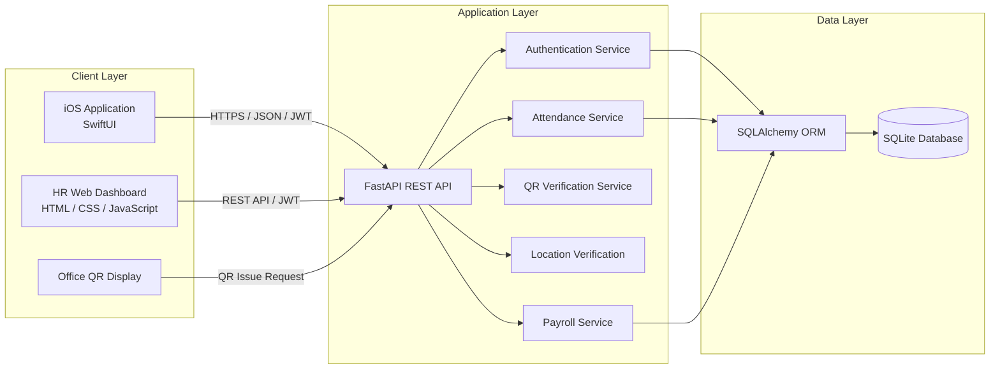
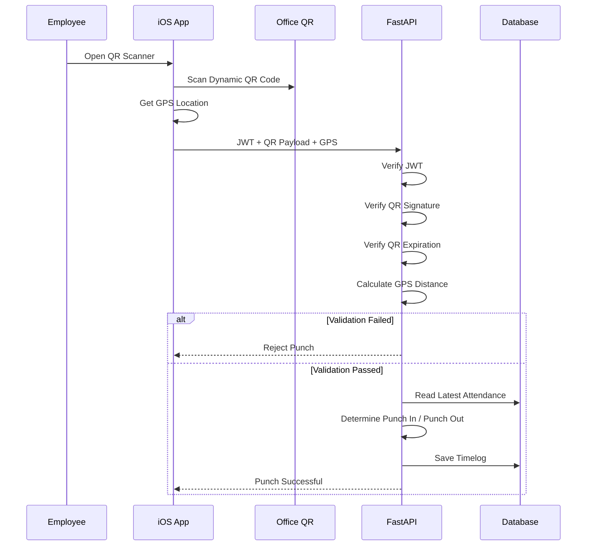
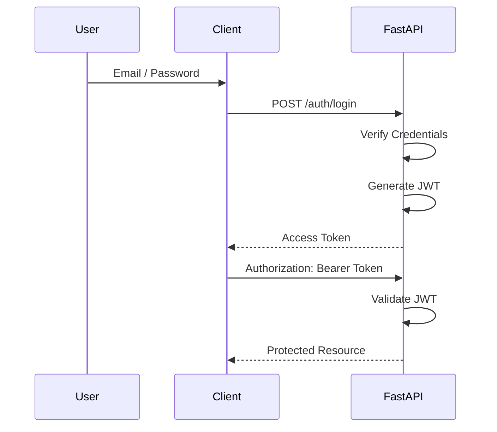
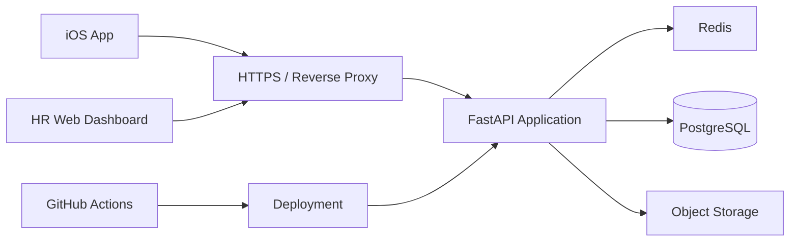

# EmployeePassHR

A Mobile Attendance and HR Management System with Dynamic QR Code and GPS Verification

EmployeePassHR 是一套以企業員工出勤管理為核心所開發的行動化人資系統，整合 **iOS 行動應用程式、FastAPI RESTful API、Web HR Dashboard、動態 QR Code 與 GPS 定位驗證**。

系統將員工日常的打卡流程與後台人資管理整合，員工可透過 iOS App 掃描公司動態 QR Code 完成上下班打卡，後端同時驗證 QR Code 有效性、使用者身分與 GPS 位置；管理者則可透過 Web Dashboard 查看每日出勤、遲到、工時、加班與薪資統計。

本專案主要著重於：

* Mobile App 與 Backend API 整合
* JWT Authentication 與角色權限控制
* Dynamic QR Code Attendance
* GPS Geofencing Verification
* Attendance Data Processing
* Payroll Calculation
* HR Management Dashboard
* RESTful API Design

---

# System Preview

## iOS Employee Application

<!--


-->

建議展示：

* 登入畫面
* 員工首頁
* QR Code 掃描畫面
* GPS 打卡結果
* 出勤紀錄
* 薪資預覽
* 個人資料

---

## HR Web Dashboard

<!--


-->

建議展示：

* HR 登入介面
* 每日出勤 Dashboard
* 員工出勤狀態
* 月薪統計
* CSV 匯出功能

---

## Dynamic QR Attendance

<!--

-->

公司端可透過固定螢幕顯示具有時效性的 Dynamic QR Code，員工使用 iOS App 掃描後，由 Backend 完成 QR、GPS 與身分驗證。

---

# Project Motivation

傳統紙本簽到或單純以固定 QR Code 實作的打卡方式，容易面臨：

* 固定 QR Code 被截圖後轉傳
* 無法確認員工實際所在地點
* 出勤、工時與薪資資料分散
* 人資需要額外整理每日出勤紀錄
* 行動端與後台管理系統缺乏整合

因此本專案將：

```text
Employee Identity
        +
Dynamic QR Code
        +
GPS Location
        +
Attendance Record
        +
Payroll Calculation
```

整合成完整的數位出勤流程。

系統並非單純記錄一筆打卡資料，而是在一次打卡過程中同時進行：

```text
Who
使用者是誰

Where
是否位於公司允許的打卡範圍

When
QR Code 是否仍在有效時間內

What
本次動作應判斷為上班或下班
```

藉此提高行動打卡流程的完整性與可靠性。

---

# System Architecture

EmployeePassHR 採用 Mobile、Backend、Database 與 Web Management Interface 分離的架構。



---

# Core Technical Architecture

## 1. iOS Application Layer

iOS App 主要負責：

```text
User Interface
      |
      v
Authentication
      |
      v
Camera / QR Scanner
      |
      v
CoreLocation
      |
      v
REST API Communication
```

主要使用：

* Swift
* SwiftUI
* AVFoundation
* CoreLocation
* URLSession

其中：

**AVFoundation**

負責取得相機畫面並辨識 QR Code。

**CoreLocation**

負責取得使用者目前經緯度，提供後端進行打卡範圍驗證。

**URLSession**

負責與 FastAPI Backend 進行 RESTful API 溝通。

---

## 2. Backend Application Layer

Backend 使用 FastAPI 建構 RESTful API，負責整套系統的核心商業邏輯。

```text
HTTP Request
     |
     v
FastAPI Router
     |
     +----------------------+
     |                      |
     v                      v
Authentication         Business Logic
                            |
             +--------------+-------------+
             |              |             |
             v              v             v
         Attendance      QR Verify      Payroll
             |
             v
        SQLAlchemy ORM
             |
             v
          Database
```

Backend 負責：

* Authentication
* JWT Token 驗證
* Employee / Admin Role
* QR Code 產生
* QR Code 簽章
* QR Code 時效驗證
* GPS 距離計算
* Punch In / Punch Out 判斷
* Attendance Record
* Working Hours Calculation
* Late Detection
* Overtime Calculation
* Payroll Calculation
* CSV Export
* HR Dashboard API

---

## 3. Data Layer

系統透過 SQLAlchemy ORM 存取資料庫。

目前開發環境採用 SQLite，將 Database Layer 與 Business Logic 分離，未來可以進一步替換為：

```text
PostgreSQL
MySQL
MariaDB
```

而不需要重新設計主要 API 邏輯。

---

# Attendance Workflow

完整打卡流程如下：



---

# Dynamic QR Code Design

若公司只使用固定 QR Code：

```text
QR Code
   |
Screenshot
   |
Forward to another employee
   |
Remote Punch
```

將存在 QR Code 被截圖或轉傳的風險。

因此 EmployeePassHR 使用具有時效性的 Dynamic QR Code。

概念如下：

```text
Timestamp / Expiration
        +
QR Payload
        +
Shared Secret
        |
        v
    HMAC Signature
        |
        v
 Dynamic QR Code
```

Backend 收到 Punch Request 後會重新驗證：

```text
QR Payload
    |
    +--> Signature Valid?
    |
    +--> Token Expired?
    |
    +--> Request Valid?
```

只有通過驗證後才會進入下一階段的 GPS Validation。

---

# GPS Attendance Verification

QR Code 驗證之外，系統也會取得 iOS 裝置目前 GPS 座標。

```text
Employee Location
(latitude, longitude)

        |

        | distance calculation

        v

Office Location
(latitude, longitude)
```

Backend 根據公司座標與允許距離判斷：

```text
distance <= OFFICE_RADIUS_M
```

才允許完成打卡。

整體驗證邏輯因此形成：

```text
Authentication
      |
      v
QR Verification
      |
      v
GPS Verification
      |
      v
Attendance Logic
      |
      v
Database
```

---

# Authentication Architecture

系統採用 JWT Authentication。



使用 JWT 的目的在於讓 iOS App 與 Web Client 可以透過相同 Backend Authentication Mechanism 存取受保護資源。

---

# Role-Based Access Control

目前系統區分：

```text
Employee
Admin
```

## Employee

可以：

* 查看個人資料
* 執行上下班打卡
* 查看個人出勤紀錄
* 查看薪資預覽
* 使用個人 Calendar

## Admin

除了基本驗證外，可以：

* 查看全體員工
* 查看每日出勤
* 搜尋員工
* 修改員工時薪
* 查看月薪統計
* 匯出 Attendance CSV
* 匯出 Payroll CSV

---

# Attendance Processing

一次打卡並不是單純新增資料。

Backend 會根據使用者最新的 Timelog 自動判斷本次行為。

```text
No active attendance record
          |
          v
       Punch In

Existing Punch In
without Punch Out
          |
          v
       Punch Out
```

完成上下班資料後，即可進一步計算：

```text
Punch In
   |
   +--------------+
   |              |
   v              v
Late?         Punch Out
                  |
                  v
             Worked Time
                  |
            +-----+------+
            |            |
            v            v
       Regular Time   Overtime
```

---

# Working Hours and Overtime

目前系統以每日 8 小時作為標準工作時間。

```text
Standard Work Time
= 8 Hours
= 480 Minutes
```

若：

```text
Worked Minutes > 480
```

則：

```text
Overtime Minutes
=
Worked Minutes - 480
```

否則：

```text
Overtime Minutes = 0
```

---

# Late Detection

系統可根據上班 Punch In 時間判斷是否遲到。

目前預設判斷時間：

```text
09:10
```

概念：

```text
Punch In <= 09:10
        |
        v
      Normal

Punch In > 09:10
        |
        v
       Late
```

後續可以再將公司上下班規則抽離成獨立 Shift / Attendance Policy。

---

# Payroll Calculation

系統會根據：

* Hourly Rate
* Working Hours
* Overtime Hours
* Overtime Multiplier

進行薪資統計。

概念公式：

```text
Regular Pay
=
Regular Hours x Hourly Rate
```

```text
Overtime Pay
=
Overtime Hours
x Hourly Rate
x Overtime Multiplier
```

```text
Gross Pay
=
Regular Pay + Overtime Pay
```

目前預設：

```text
OVERTIME_MULTIPLIER = 1.33
```

管理者可以透過 HR Dashboard 查看每位員工的：

```text
Attendance Days
Working Hours
Overtime Hours
Regular Pay
Overtime Pay
Gross Pay
```

---

# HR Management Dashboard

除了 iOS 員工端之外，本專案亦建置 Web HR Dashboard。

其架構為：

```text
HR Browser
     |
     v
Web Dashboard
     |
     v
REST API
     |
     v
FastAPI
     |
     v
Attendance / Payroll Service
     |
     v
Database
```

HR 可直接透過 Browser 使用，不需要額外安裝桌面程式。

---

## Daily Attendance Dashboard

提供：

```text
Employee
Status
Punch In
Punch Out
Worked Hours
Overtime
Late Status
```

<!--

-->

---

## Monthly Payroll Dashboard

提供：

```text
Employee
Hourly Rate
Attendance Days
Working Hours
Overtime Hours
Regular Pay
Overtime Pay
Gross Pay
```

<!--

-->

---

# CSV Export

為了讓出勤資料能夠進一步與：

* Excel
* Google Sheets
* Existing HR Systems
* Accounting Workflow

整合，Backend 提供 Attendance 與 Payroll CSV Export。

```text
EmployeePassHR
      |
      v
FastAPI
      |
      v
CSV Generator
      |
      v
Attendance.csv
Payroll.csv
```

---

# Technology Stack

| Layer          | Technology              | Purpose                   |
| -------------- | ----------------------- | ------------------------- |
| Mobile         | Swift                   | iOS Development           |
| UI             | SwiftUI                 | Declarative UI            |
| Camera         | AVFoundation            | QR Code Scanner           |
| Location       | CoreLocation            | GPS Position              |
| Networking     | URLSession              | REST API Communication    |
| Backend        | Python                  | Server Development        |
| API            | FastAPI                 | RESTful API               |
| Authentication | JWT                     | User Authentication       |
| ORM            | SQLAlchemy              | Database Access           |
| Database       | SQLite                  | Development Database      |
| QR             | qrcode / Pillow         | QR Code Generation        |
| Security       | HMAC                    | QR Signature Verification |
| Web            | HTML / CSS / JavaScript | HR Dashboard              |
| UI Framework   | Bootstrap               | Web Interface             |

---

# RESTful API Design

主要 API 可分為以下 Domain：

```text
/api
 |
 +-- Authentication
 |
 +-- User
 |
 +-- Attendance
 |
 +-- QR Code
 |
 +-- Calendar
 |
 +-- Payroll
 |
 +-- Admin
```

---

## Authentication

```http
POST /auth/login
POST /auth/register
GET  /me
```

---

## Attendance

```http
POST /punch
GET  /timelogs/history
```

---

## QR Code

```http
GET /qr/issue
GET /qr/public/issue
GET /qr/public/png
```

---

## Payroll

```http
GET /payroll/preview
```

---

## Calendar

```http
GET  /calendar
POST /calendar
```

---

## Admin

```http
GET   /admin/users
PATCH /admin/users/{user_id}/hourly_rate

GET /admin/attendance/daily
GET /admin/attendance/export/csv

GET /admin/payroll/monthly
GET /admin/payroll/export/csv
```

---

# Project Structure

```text
EmployeePassHR/
│
├── backend/
│   │
│   ├── main.py
│   ├── employee_pass.db
│   │
│   └── web/
│
├── ios/
│   │
│   ├── EmployeePassHRApp.swift
│   ├── APIClient.swift
│   ├── AuthView.swift
│   ├── MainTabView.swift
│   ├── LocationService.swift
│   ├── Models.swift
│   └── page.swift
│
├── web/
│   └── qr_admin.html
│
└── README.md
```

---

# Technical Highlights

## Dynamic QR Code

使用具有有效期限與簽章驗證的 QR Payload，相較於固定 QR Code，降低截圖與轉傳後進行遠端打卡的可能性。

## GPS Verification

利用 iOS CoreLocation 取得裝置位置，再由 Backend 判斷使用者是否位於公司允許的打卡範圍。

## Multi-Client Architecture

同一套 FastAPI Backend 同時服務：

```text
iOS Employee App
HR Web Dashboard
Office QR Display
```

讓不同 Client 共用 Authentication、Attendance 與 Payroll Business Logic。

## RESTful API Separation

Mobile UI 與 Backend Business Logic 分離，使未來 Android App、其他 Web Frontend 或第三方 HR 系統可以使用相同 API。

## Attendance Data Pipeline

系統將：

```text
Punch
 -> Timelog
 -> Working Hours
 -> Overtime
 -> Payroll
```

串成一套完整資料處理流程，而非僅實作單一打卡功能。

## Role-Based Management

透過 Employee / Admin Role 將員工個人功能與 HR 管理功能分離。

---

# What I Learned

透過 EmployeePassHR 的開發，我實際整合了 Mobile Application、Backend、Database 與 Web Dashboard，而非僅開發單一 Client Application。

專案開發過程涵蓋：

```text
Requirement Analysis
        |
        v
System Architecture
        |
        v
Database Design
        |
        v
RESTful API Design
        |
        v
Authentication
        |
        v
Mobile Integration
        |
        v
Location / QR Verification
        |
        v
Attendance Processing
        |
        v
HR Dashboard
```

其中主要累積的技術經驗包括：

* SwiftUI App Architecture
* iOS Camera Integration
* CoreLocation Integration
* RESTful API Integration
* FastAPI Backend Development
* JWT Authentication
* SQLAlchemy ORM
* Role-Based Access Control
* HMAC Signature Verification
* Attendance Business Logic
* Payroll Data Processing
* Frontend / Backend Integration

---

# Engineering Considerations

在開發 EmployeePassHR 時，我除了完成系統功能，也考慮到實際企業應用可能面臨的問題。

## Security

```text
JWT Authentication
Dynamic QR Signature
QR Expiration
GPS Verification
Role-Based Authorization
```

## Maintainability

```text
Client
   |
REST API
   |
Business Logic
   |
ORM
   |
Database
```

透過分層方式降低 UI 與 Backend Business Logic 的耦合。

## Extensibility

目前架構未來可以延伸：

```text
Leave Management
Shift Management
Department Management
Approval Workflow
Employee Management
Push Notification
Cloud Database
Docker Deployment
CI/CD
```

---

# Current Development Status

目前核心 Backend、Web HR Dashboard、Dynamic QR、Attendance 與 Payroll 功能已完成 Prototype。

部分 iOS API Contract 仍需要進一步與最新 Backend Endpoint 統一。

目前已完成：

```text
[Completed] JWT Authentication
[Completed] Employee / Admin Role
[Completed] Dynamic QR Code
[Completed] HMAC QR Verification
[Completed] GPS Attendance Verification
[Completed] Punch In / Punch Out
[Completed] Attendance History
[Completed] Daily Attendance Dashboard
[Completed] Working Hours Calculation
[Completed] Late Detection
[Completed] Overtime Calculation
[Completed] Payroll Calculation
[Completed] Payroll Dashboard
[Completed] Attendance CSV Export
[Completed] Payroll CSV Export
[Completed] Calendar Backend API
```

後續規劃：

```text
[Planned] Align iOS / Backend API Contract
[Planned] Leave Request Workflow
[Planned] Shift Management
[Planned] Employee Management CRUD
[Planned] Department Management
[Planned] Refresh Token
[Planned] Production Database
[Planned] Docker Deployment
[Planned] Automated Testing
[Planned] CI/CD
```

---

# Future Architecture

若進一步將系統部署至 Production，可調整為：



可進一步加入：

* PostgreSQL
* Redis
* Docker
* Nginx
* HTTPS
* Object Storage
* Automated Testing
* GitHub Actions CI/CD
* Cloud Deployment

---

# Repository

GitHub Repository:

```text
https://github.com/yang920916/EmployeePassHR
```

---

# Author

Developed as a full-stack mobile attendance and HR management system project, focusing on the integration of mobile applications, backend APIs, authentication, location verification, attendance processing and HR management workflows.
